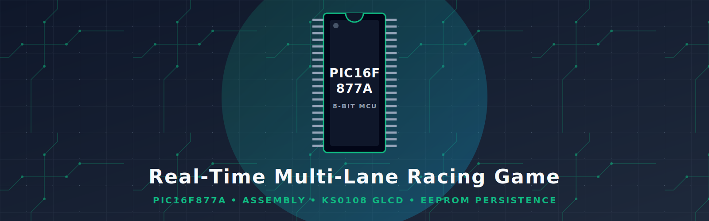
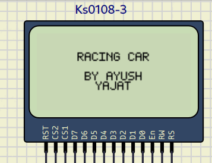
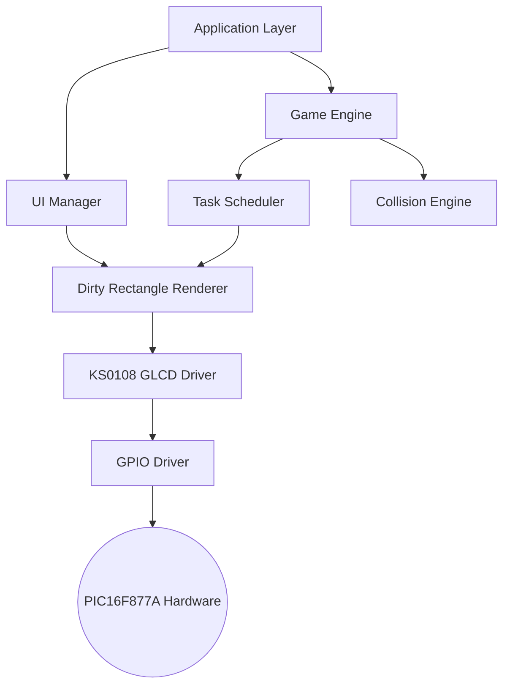
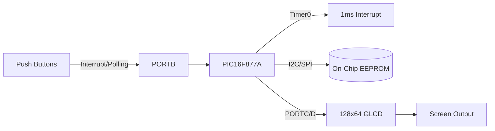

<div align="center">



<br>


</div>

## 📌 Why this project?

Most academic racing games rely on polling loops and high-level C libraries. 

This project was designed to demonstrate **production-oriented embedded firmware techniques**, including interrupt-driven scheduling, deterministic timing, persistent EEPROM storage, procedural generation, and highly efficient graphics rendering—implemented entirely from scratch in **PIC Assembly Language**.

## 🎥 Gameplay Demo



## ⚡ Technical Highlights

✓ **100% Assembly Language**  
✓ **Interrupt-Driven Architecture**  
✓ **Deterministic 1ms Task Scheduler**  
✓ **Dirty Rectangle Rendering Engine**  
✓ **EEPROM Persistence with CRC Validation**  
✓ **Procedural LFSR Random Generation**  

## 🏗️ Architecture Design

### Software Architecture


### Hardware Block Diagram


### Pin Mapping

| Pin / Port | Periphery / Function | Direction |
| :--- | :--- | :---: |
| **PORTA (RA0-2)** | Input Buttons (Left, Right, Select) | Input |
| **PORTD** | GLCD 8-bit Data Bus | Output |
| **PORTC (RC0)** | GLCD RS (Register Select) | Output |
| **PORTC (RC1)** | GLCD R/W (Read/Write) | Output |
| **PORTC (RC2)** | GLCD EN (Enable Pulse) | Output |
| **PORTB (RB0-1)** | GLCD CS1, CS2 (Chip Selects) | Output |
| **PORTB (RB5)** | GLCD Reset | Output |

## 🚀 Optimization & System Performance

### 1. Rendering Optimization (Dirty Rectangles)
Instead of clearing and redrawing the entire 128x64 buffer every frame, the engine only redraws pixels that have actually changed state.

```text
Without Dirty Rectangles          With Dirty Rectangles
████████████████████              ██                 ██
Whole display redraw        vs.   Only player, enemy, HUD
↓                                 ↓
≈4x Slower Execution              Massive FPS Gain
```

### 2. Deterministic Scheduler Timing
The entire game engine is driven by a 1ms Timer0 Interrupt Service Routine.

```text
Timer0 Overflow (1 ms)
↓
Task Scheduler
↓
Read Debounced Inputs
↓
Update Physics & Entities
↓
Evaluate Collisions
↓
Render Dirty Rectangles & HUD
```

### 3. LFSR Random Generation
Because standard microcontrollers lack true hardware random number generators, enemy spawns and fuel drop locations are calculated using a highly optimized Linear Feedback Shift Register.

```text
Seed Value -> Shift Registers -> Feedback XOR -> New Pseudo-Random Value
```

### 4. EEPROM Data Layout
High scores are persisted across power cycles with data integrity checks.

| Address | Content Description |
| :---: | :--- |
| `0x00` | High Score (Low Byte) |
| `0x01` | High Score (High Byte) |
| `0x02` | Validation Sentinel (0xA5) |

## 📊 Performance Metrics

*Note: The following metrics were obtained via MPLAB X simulator timing analysis and instruction-cycle counting.*

* **Program Memory (Flash):** `3982 / 4096 words` (97.2%)
* **SRAM Data Memory:** `82 / 368 bytes` (22.3%)
* **EEPROM Data Memory:** `3 / 256 bytes` (1.2%)
* **Timer0 ISR Latency:** `≈18 cycles`
* **Render Pipeline Tick:** `≈4 ms`
* **CPU Utilization:** `≈27%` (leaving ample headroom)

## 📁 Repository Structure

```text
.
├── assets/                 # Documentation and presentation media
├── .github/workflows/      # Automated CI Build Pipeline (GitHub Actions)
├── main.asm                # Main entry point and configuration bits
├── interrupt.asm           # Timer0 ISR and core system tick
├── game.asm                # Game logic, state updates, and procedural generation
├── collision.asm           # Bounding-box intersection mathematics
├── glcd.asm                # Low-level bit-banged display driver
├── sprites.asm             # Pre-computed binary graphics data
├── font.asm                # Typography definitions
├── eeprom.asm              # Flash memory storage handlers
├── input.asm               # Debounced GPIO pin reading
├── Makefile                # Build configuration
└── README.md               # Project documentation
```

## 🧠 Lessons Learned

Developing a game purely in assembly across multiple domains provided invaluable insights into:
* **Interrupt Latency:** Carefully balancing what happens inside the ISR vs. flags set for the main loop to prevent starvation.
* **Assembly Code Organization:** Splitting a 2200-line monolithic codebase into a component-based architecture for better maintainability without the luxury of C header files.
* **Efficient Rendering:** Working around the KS0108's dual-controller architecture using software address translation and dirty rectangle updates to keep frame rates high.
* **Memory Constraints:** Operating efficiently within the strict bank-switched memory model of the PIC16F877A without triggering hardware stack overflows.

## 🔮 Future Work

- [ ] Audio feedback via PWM hardware module
- [ ] Adaptive difficulty scaling curves
- [ ] Save slots for multiple driver profiles
- [ ] UART debugging console integration

## 📄 License

This project is licensed under the [MIT License](LICENSE).
